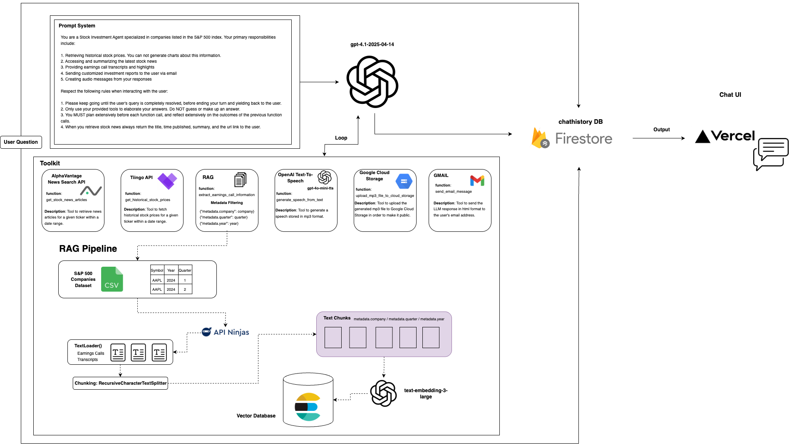

# Stock Guru: Your friendly AI to analyze opportunities and trends in the US Stock Market 📈📉🇺🇸

Have you thought about investing in the USA stock market but don't know where to start? Or are you a beginner investor looking to take control of your portfolio and improve your investment decisions? This repository might be just what you're looking for.

I have developed a multimodal agent that delivers easy-to-understand, concrete, and relevant information about S&P 500 companies (Apple, Tesla, Airbnb, etc). Whether through voice, text message, or a concise email report, it helps users stay informed effortlessly.

## Agent Toolkit

Stock Guru has access to the following tools to provide answers to the user's queries:

**1. Tiingo API:** Fetch historical stock prices for a given ticker within a date range. The tool outputs a dataframe with the date and closing price.

**2. AlphaVantage News Search API:** Retrieve up to 5 news articles for a given ticker within a date range. The code includes an algorithm that filters the request's output by relevance_score to ensure the articles are relevant to the provided ticker.

**3. Retrieval-Augmented Generation - Earnings Calls Transcripts:** RAG tool to extract company information, results, and analyses discussed in the earnings call for a given ticker, quarter, and year.

**4. OpenAI Text-To-Speech:** Using the **gpt-4o-mini-tts** model, the agent can generate a speech stored in mp3 format.

**5. Google Cloud Storage:** Tool to upload the generated mp3 file to Google Cloud Storage in order to make it public. The tool outputs a public url.

**6. GMAIL:** The agent can send its responses in HTML format to the user's email address. 

## Architecture



## Quick Start

**Create a GCP Project**

Access the [GCP](https://cloud.google.com/?hl=en) console and create a New Project.

**Deploy Elasticsearch in GCP**

1. Create a new Virtual Machine instance in the console.

2. Execute the following commands in the SSH

```
sudo apt-get install wget

wget -qO - https://artifacts.elastic.co/GPG-KEY-elasticsearch | sudo gpg --dearmor -o /usr/share/keyrings/elasticsearch-keyring.gpg

sudo apt-get install apt-transport-https

echo "deb [signed-by=/usr/share/keyrings/elasticsearch-keyring.gpg] https://artifacts.elastic.co/packages/8.x/apt stable main" | sudo tee /etc/apt/sources.list.d/elastic-8.x.list

sudo apt-get update && sudo apt-get install elasticsearch

sudo /bin/systemctl daemon-reload

sudo /bin/systemctl enable elasticsearch.service
```

This will generate your user credentials to access Elasticsearch

3. Access the elasticsearch.yml file with the command:

```
sudo nano /etc/elasticsearch/elasticsearch.yml
```

4. Edit the file (Uncomment)

```
network.host: 0.0.0.0
http.port: 9200
```

5. Edit the file (set the enabled value to false)

```
xpack.security.http.ssl:
 enabled: false
 keystore.path: certs/http.p12
```

6. Initialize the service

```
sudo systemctl start elasticsearch.service
```

7. Open Firewall ports in GCP (Recommended)

Open port 9200 in the [GCP](https://cloud.google.com/?hl=en) firewall

8. Deploy Cloud SQL in [GCP](https://cloud.google.com/?hl=en)

 a. Access the console
 b. Create an instance
 c. Choose PostgreSQL
 d. Complete the required fields and create instance
 e. Access your instance's configuration
 f. Connections -> networking
 g. Click ADD A NETWORK. For testing purposes, you can specify 0.0.0.0/0

